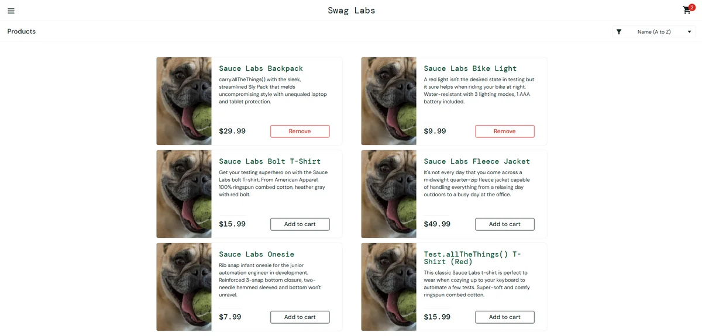
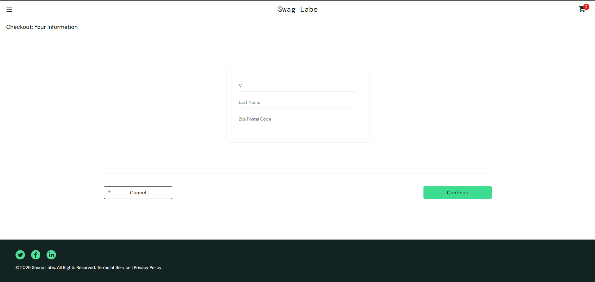
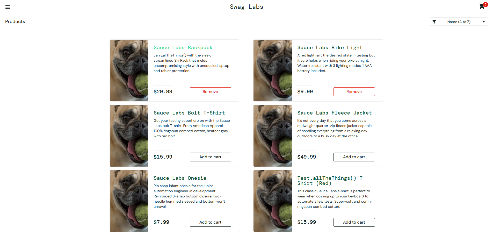

# Relatório de Bugs
---------------------------------------------------------------------------

## CT004 – Produto não pode ser removido pela tela inicial

Passos para reproduzir:
1. Realizar login
2. Adicionar produto ao carrinho
3. Tentar removê-lo pela tela inicial

Resultado atual:
O botão "Remove" na tela inicial não remove o produto.

Resultado esperado:
O produto deveria ser removido diretamente da tela inicial.

Severidade: Baixa

---------------------------------------------------------------------------

## CT005 – Campo sobrenome sobrescreve o nome

Passos para reproduzir:
1. Realizar login
2. Ir para checkout
3. Inserir nome e sobrenome

Resultado atual:
O sobrenome substitui o nome.

Resultado esperado:
Os campos devem funcionar separadamente.

Severidade: Alta

---------------------------------------------------------------------------

##CT006 - Ordenação de produtos não funciona

Passos para reproduzir:
1.Realizar login
2.Na tela inicial, clicar em ordenar por preço ou em ordem alfabética.

Resultado atual:
Ao clicar em organizar produtos por preço ou em qualquer outra ordem, não é realizada nenhuma ação no site, e se mantém na mesma ordem.

Resultado esperado:
Ao selecionar uma ordem, os produtos são listados de acordo com a ordem selecionada.

Severidade: Média

---------------------------------------------------------------------------
